# describingWebArchives

Automating description for Web Archives in ArchivesSpace using the Archive-It CDX and Partner Data APIs

* `simpleRequest.py` demonstrates how to make Partner Data API requests in Python

* `partnerData.py` is a command line tool for requesting data from the partner data 

* `partnerData.exe` and `partnerData.bin` are binary executables of the `partnerData.py` command line tool for Windows and Unix systems respectively.


* `describingWebArchives.py` automatically creates ArchivesSpace records for new captures with provenance information from the Partner Data API. Only requires:
	* Any resource or archival object assigned to a specific subject to denote it as a Web Archives Record
	* A Physical Characteristics and Technical Requirements note that lists the original page URL


## Overview of Partner Data API calls

* All API calls start with the root URL https://partner.archive-it.org/api/
* All calls accept format param for json, xml, csv (&format=json, &format=xml, &format=csv)
* If you login to Archive-It in the browser, you can view these calls by pasting them into your browser

### Collections

* https://partner.archive-it.org/api/collections

##### Useful Params:
* ?account=652 (limit to partner ID)
* ?id=7082 (limit to collection ID)
* ?created_by=gwiedeman (limit to created by specific user)

##### Examples:

* https://partner.archive-it.org/api/collections?account=652
* https://partner.archive-it.org/api/collections?account=652&id=3308
* https://partner.archive-it.org/api/collections?id=3308
* https://partner.archive-it.org/api/collections?account=652&created_by=gwiedeman

### Seeds

* https://partner.archive-it.org/api/seed/:id
* https://partner.archive-it.org/api/seed (requires a param)


##### Useful Params:
* ?collection=6372
* ?account=652 (requires login)

##### Examples:
* https://partner.archive-it.org/api/seed/1080629
* https://partner.archive-it.org/api/seed?collection=6372
* https://partner.archive-it.org/api/seed?account=652 (requires login)

### Crawls

* https://partner.archive-it.org/api/crawl_job/:id (requires login)

##### Examples:
* https://partner.archive-it.org/api/crawl_job/303101

### Host Rules

* https://partner.archive-it.org/api/host_rule (requires login)

##### Useful Params:
* ?collection=7801

##### Examples:
* https://partner.archive-it.org/api/host_rule?collection=3308 (requires login)
* https://partner.archive-it.org/api/host_rule (requires login)

### Seed Rules

* https://partner.archive-it.org/api/scope_rule (requires login)

##### Useful Params:
* ?collection=6372

##### Examples:
* https://partner.archive-it.org/api/scope_rule?collection=6372 (requires login)
* https://partner.archive-it.org/api/scope_rule (requires login)

## `simpleRequest.py`

This is a sample script to demonstrate the simplest way to request data from the Archive-it Partner Data API

### Prerequisites
* Python 2 or 3
* `requests` library
* Does not require an Archive-it account to view some public data

### Basic Use

1. Enter your Archive-It account credentials on lines 5-7
2. Edit the request URL on line 15 state a valid URL from the Partner Data API calls above. The default should return data on the University at Albany, SUNY Website collection.
3. run `python simpleRequest.py` from the command line

## `partnerData` command line tool

### Prerequisites
* Binary files should have no prerequisites, except an Archive-It account for non-public endpoints
* .exe for windows, .bin for Linux which should work on OSX but is untested
	* Windows may give security error notice for unsigned exe
* Login credentials can be stored in `local_settings.cfg` as detailed below, or entered with `-a account -u user -p password` flags
* `partnerData.py` requires `requests` and `configparser`

### Basic Use

#### Cross-platform
* Python users change examples from `partnerData` to `python partnerData.py`
* Windows users change examples from `partnerData` to `.\partnerData.exe`
* Mac/Linux users change examples from `partnerData` to `./partnerData.bin`

#### Flags
* `-h` help manual
* `-t` type of request. Accepts collection, seed, crawl, host_rule, scope_rule. Defaults to collection.
* `-l` limiter url params (can use multiple, ampersand (&) is optional)
* `-a` Archive-It account
* `-u` Archive-It user
* `-p` Archive-It password
* `-f` Output format, accepts json, xml, csv. Defaults to json.
* `-o` Option to output a text file, accepts file path

#### Examples

without `local_settings.cfg`:

* must include: ` -a account -u user -p password`
* such as: `partnerData -a account -u user -p password -t collection -l id=6372`

with `local_settings.cfg`:

* `partnerData -t collection -l account=652`
* `partnerData -t collection -l account=652 -f csv`
* `partnerData -t collection -l id=6372`
* `partnerData -t seed -l collection=3308`
* `partnerData -t crawl -l id=303101`
* `partnerData -t crawl -l id=303101 -o C:\output\path\crawl.json`
* `partnerData -t host_rule -l collection=7801`
* `partnerData -t host_rule -l collection=3308 ignore_robots=true`
* `partnerData -t scope_rule -l collection=6372 type=DOC_LIMIT`

## `describingWebArchives.py`

This script looks for a specific subject in ArchivesSpace and if the archival objects assigned to that subject have a phystech note with the URL of the web archives collection, it will append child objects for each unique capture with details from `<meta>` tags and provenance information from the Archive-It partner data API. It will add digital objects with links to archives web pages, and finally it will update dates and extents for all parent objects.

### Prerequisites

Requires an Archive-It account and API access to an ArchivesSpace instance. Settings need to be specified in a `local_settings.cfg` file. Also requires

* `requests`
* `configparser`
* `beautifulsoup4`
* `archives_tools` ([https://github.com/UAlbanyArchives/archives_tools](https://github.com/UAlbanyArchives/archives_tools))


### Install

* Clone the archives_tools repo
	* `git clone https://github.com/UAlbanyArchives/archives_tools`
* Change to the archives_tools directory and install the library (this will also install `requests` and `configparser` dependencies).
	* `cd archives_tools`
	* `python setup.py install`
* Install Beautiful Soup 4
	* `pip install beautifulsoup4` 
* Clone the describing WebArchives repo
	* `git clone https://github.com/UAlbanyArchives/describingWebArchives`
* Change into repo directory
	* `cd ..` (if still in archives_tools directory)
	* `cd describingWebArchives` 

### Setting up local_settings.cfg

All scripts require a  `local_settings.cfg` text file that contains login credentials for both ArchivesSpace and Archive-It as well as some additional params. An example is provided in the repo. This is modeled after how I've seen a number of places store credentials for the ASpace API with the addition of an Archive-It section.

* Use `local_settings-example.cfg` as a template

```

    [ArchivesSpace]
    baseurl: http://localhost:8089
    repository: 2
    user: admin
    password: admin
    
    [Archive-It]
    account: 
    user: 
    password: 
    target_subject: Web Collection
    subject_source: local
    extent_type: captures
    access_requirements:
    	The item contains web archives preserved as WARC files. They must be access though web archival replay tools such as the "Wayback Machine." The links here direct you to files hosted by the Internet Archive, but you may also request WARC files.
    acqinfo_note:
    	Web crawling is managed through the Internet Archive's Archive-It service.
    warc_restrict_note:
    	Researchers interested in data analysis with web archives may request a WARC file. WARC files are very large and difficult to work with. Your request may take time to process, and we may be unable to deliver your request remotely. Please consult an archivist if you are interested in advanced research with web archives.
    general_internet_archive_note:
    	This crawl was performed by the Internet Archive, not the UAlbany web archiving program, so the provenance is unknown.

```
#### `[ArchivesSpace]` section

* `baseURL` is URL of your ASpace instance with 8089 as the port to access the backend API
* `repository` is the ASpace repository you'd like to update, default is 2
* `user` and `password` are ASpace credentials with API permissions

#### `[Archive-It]` section

* `account` is your Archive-It partner ID. UAlbany's is 652
* `user` and `password` are your Archive-It credentials
* `target_subject` is the local subject that must be assigned to Web Archives Records you want to update
* `subject_source` limits target subjects to a certain source such as "local"
* `extent_type` is the lable for the extent that will be updated in ArchivesSpace, make sure this extent present in your ASpace controlled values list or it will fail
* `access_requirements` this is a generic Access Restrictions note
* `warc_restrict_note` is a separate Access Restrictions note applied for records of WARC files. This lets you apply an additional restriction warning for WARC file requests.
* `acqinfo_note` this is a generic Acquisition Information note that will be added to web archives parent records if one is not already present.
* `general_internet_archive_note` this is a Acquisition Information note applied to records that are in the general Internet Archive Collections, essentially designed to say why there is limited provenance information for these.

### Setting up ArchivesSpace

* Requires a local subject denoted in `local_settings.cfg` as `target_subject`.
* Subject can be assigned to an web archives record, resource or archival object.
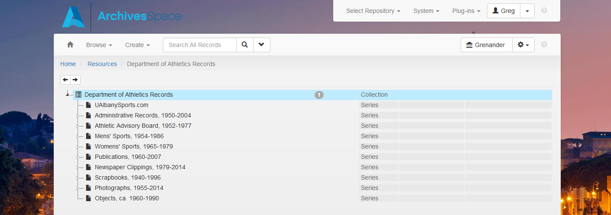
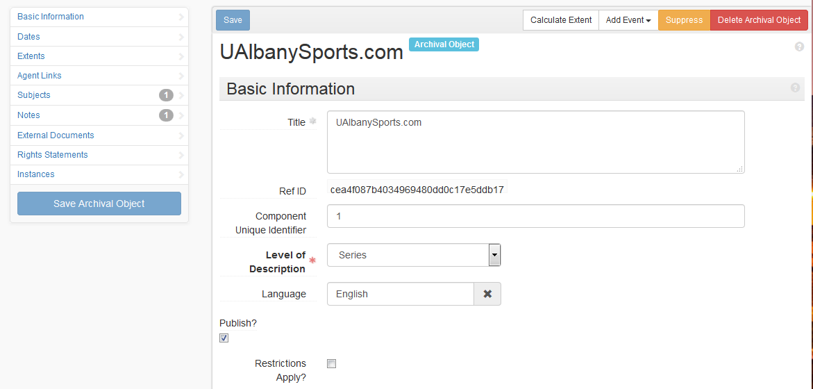
* Record must have a Physical Characteristics and Technical Requirements note with the label "URL" and the original URL of the website you are describing as a subnote.
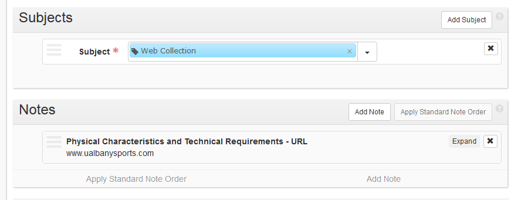

### Running the script

* This script is designed to be scheduled as a Windows Task or cron job.
* Can also just be run with `python describingWebArchives.py`
* Should not try on production instance without testing.

### Results

1. Adds Records for General Internet Archives captures with description from any `<meta>` tags, date from CDX timestamp, provenance note from `local_settings.cfg`, and digital object with direct link to content.

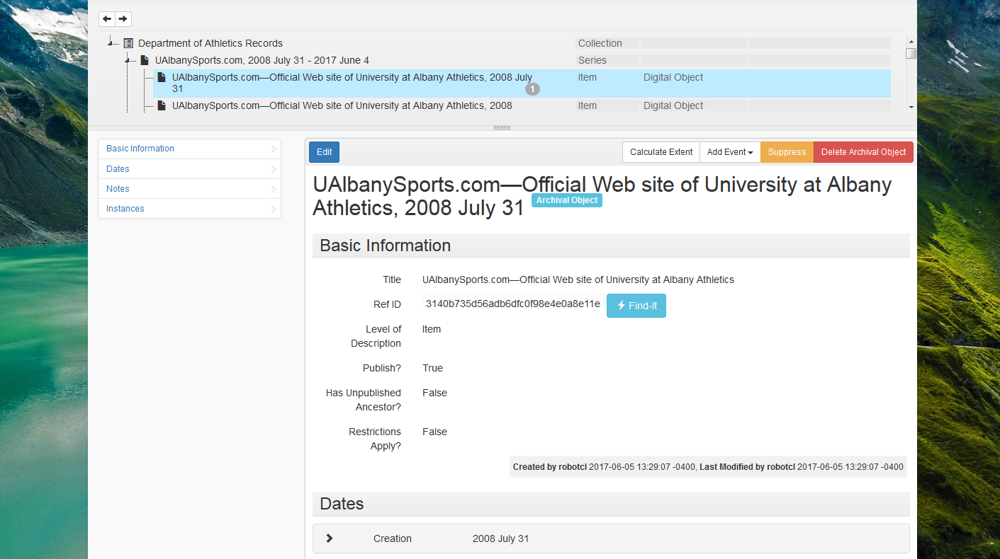
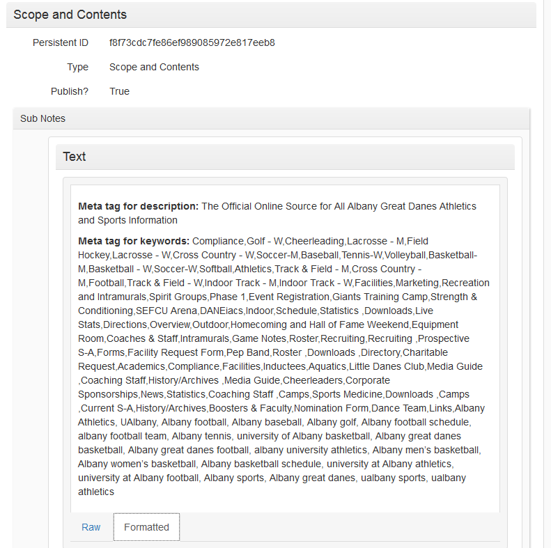
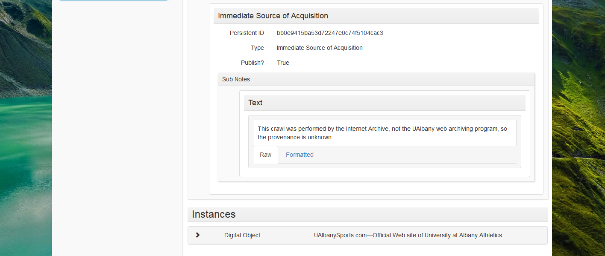

2. Adds Records for each unique Archive-it capture with description from any `<meta>` tags, date from CDX timestamp, provenance note from Partner Data API, and digital object with direct link to content.
	* Post-July 2015 records with crawl number in CDX have scoping rules, crawl, type, download failures, queued documents, etc.

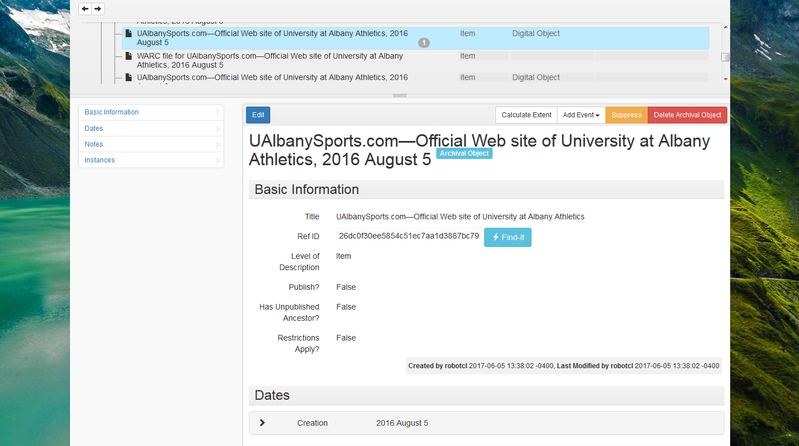
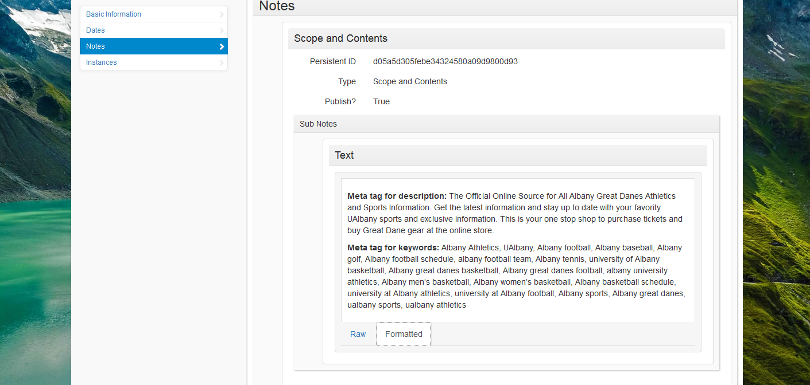
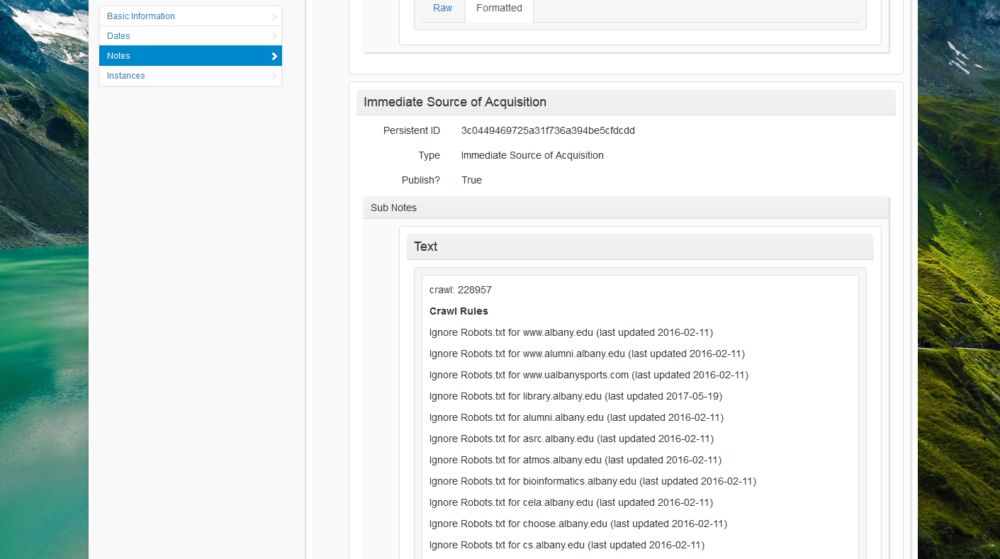
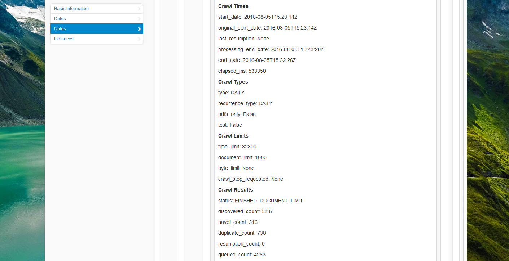
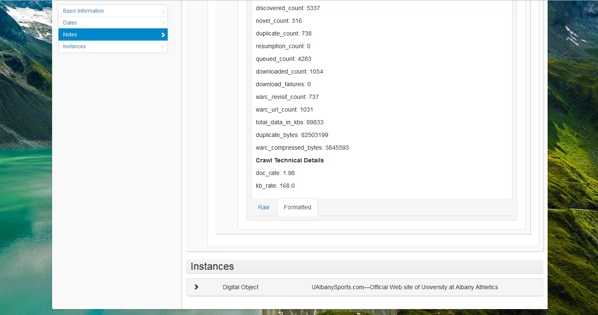

3. Adds WARC Record with same provenance information and WARC access note from `local_settings.cfg`


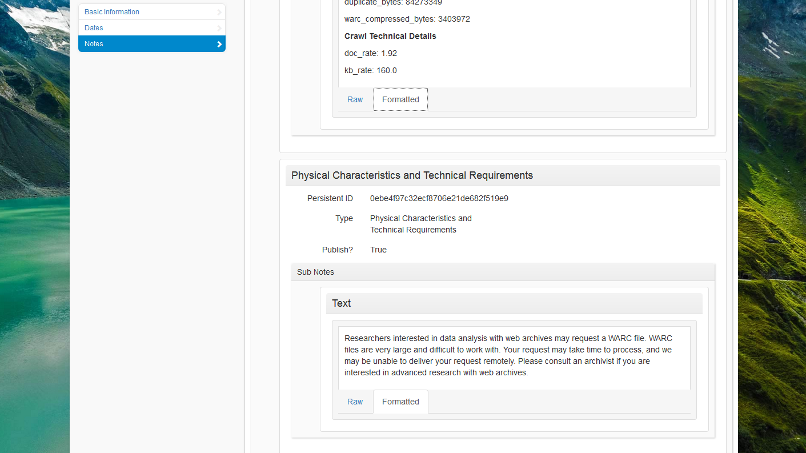

4. Updates inclusive dates and extents for parent archival objects, with optional acquisition note from `local_settings.cfg`. 


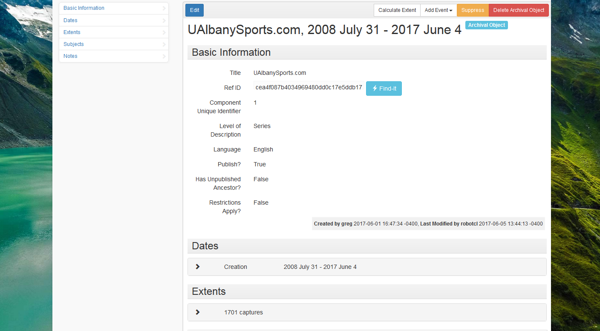
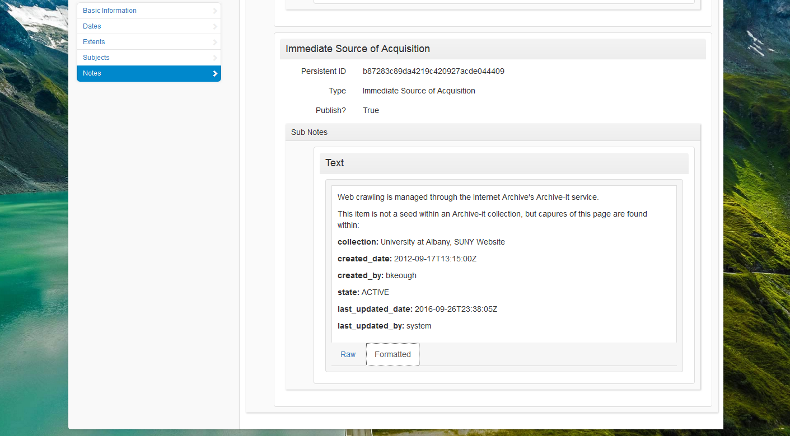

5. Updates inclusive dates and extents for resource.

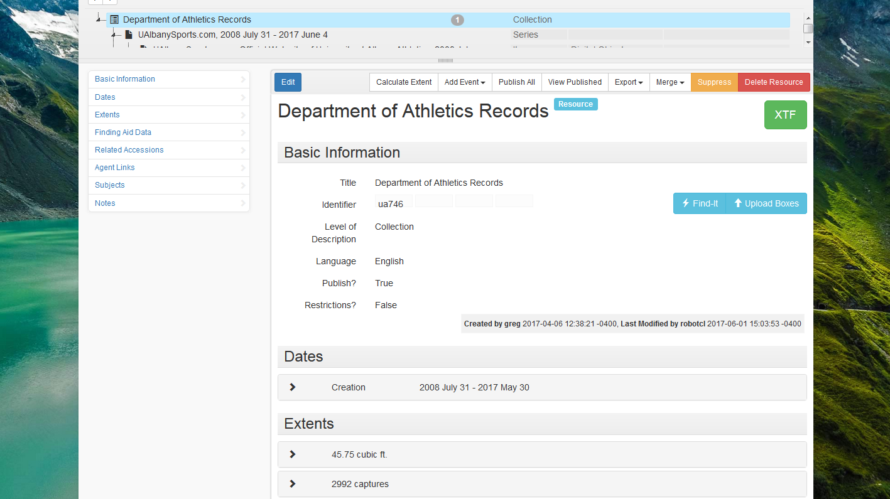

## Contributing

Comments and pull requests welcome.

## Authors

Greg Wiedeman

## License

This project is in the public domain

## Acknowledgments

Thanks to Jefferson Bailey and the Archive-It staff for sharing the API endpoints.

